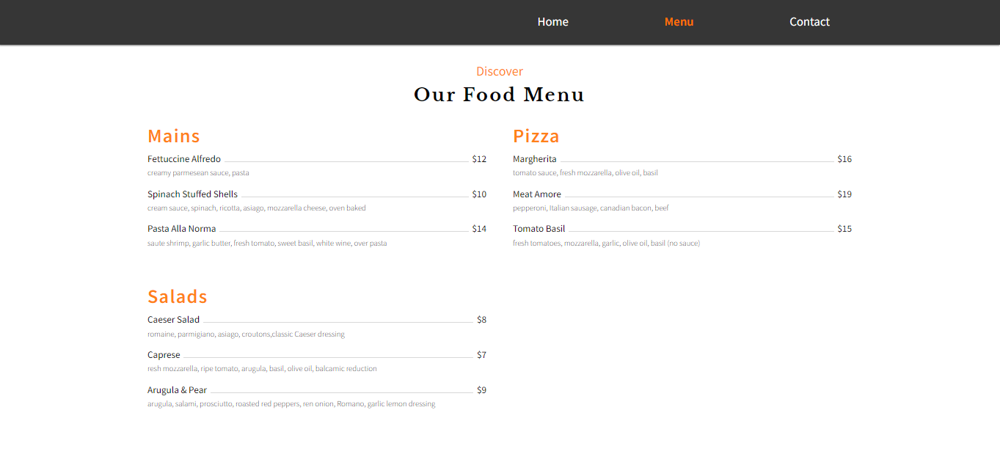

<h1> Restaurant Website</h1>

[Project live preview 🍋](https://glistening-dodol-fd33db.netlify.app/)

Simple website for the imaginary restaurant. IT was created in order to improve:
- JS Objects skills
- DOM manipulation
- CSS Animations

<h2> Screenshots </h2>

<h2> Technologies Used </h2>

- HTML5
  <a href="https://developer.mozilla.org/ru/docs/Web/HTML" target="_blank" rel="noreferrer"> &nbsp;  </a>

- CSS3
  <a href="https://developer.mozilla.org/ru/docs/Learn/Getting_started_with_the_web/CSS_basics" target="_blank" rel="noreferrer"> &nbsp;  </a>

- Webpack
  <a href="https://webpack.js.org/" target="_blank" rel="noreferrer"> &nbsp;  </a>

- SCSS
  <a href="https://sass-lang.com/documentation/" target="_blank" rel="noreferrer"> &nbsp;  </a>

<h2> Badges </h2>

&nbsp;

&nbsp;

<h2> Acknowledgements </h2>

- [Icons from FreeIcons](https://freeicons.io/)

